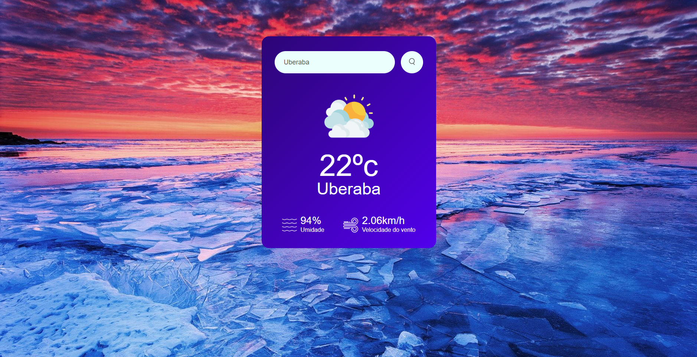

## Website Climático OpenWeatherMap

## Nome do Projeto

    Clima APP

## Sobre o Projeto

    Desenvolvimento de um Website Climático onde serão obtidos os dados da Fess API do OpenWeatherMap e serão exibidas na tela informações como temperatura, umidade e velocidade do vento.

## Conhecimentos

    . HTML
    . CSS
    . JavaScript

##

